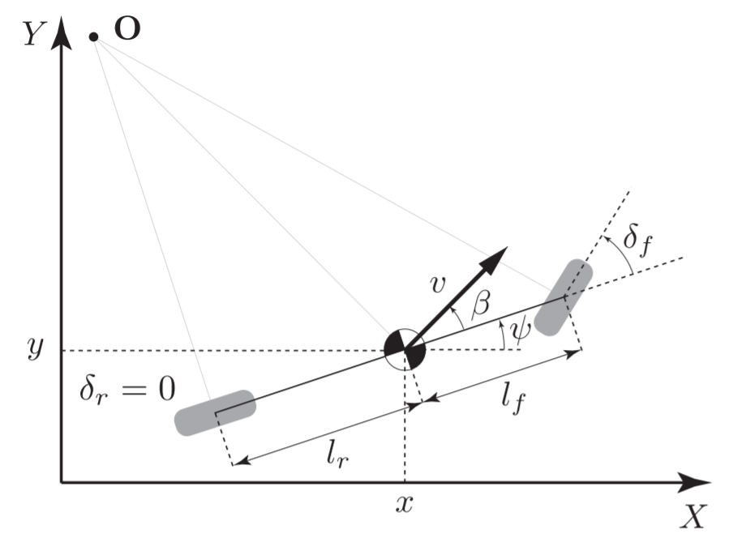
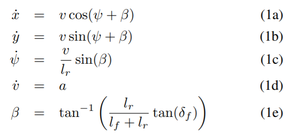
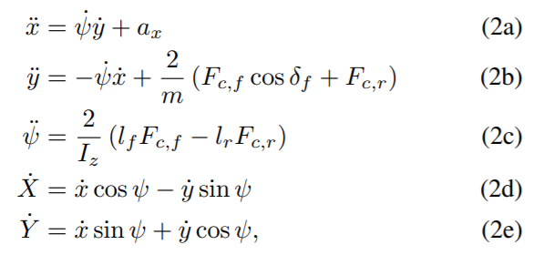
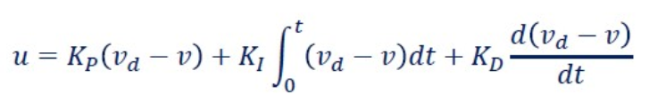
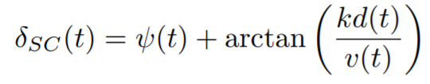
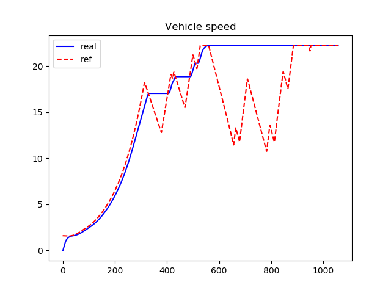
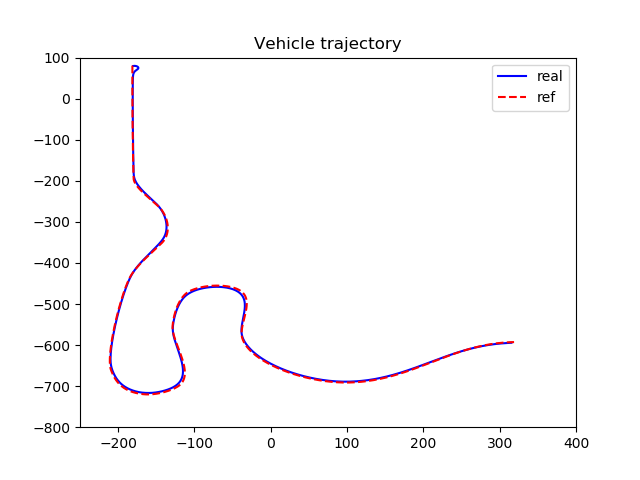
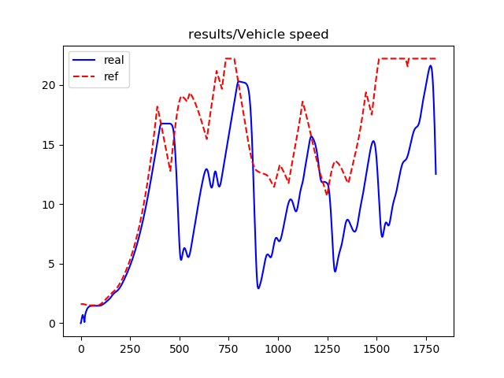
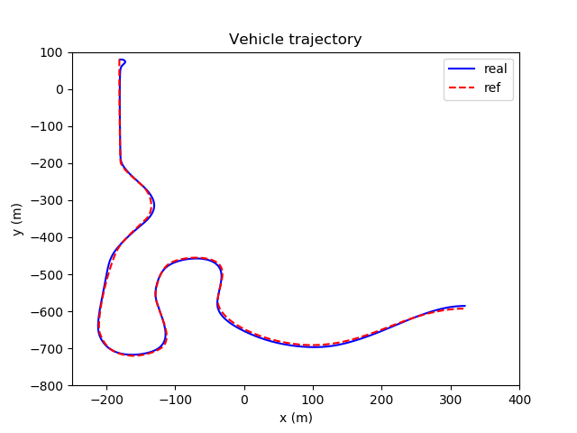

# PathTrackingBicycle
Implementation of path tracking with a linear/non-linear bicycle model. We use the PID and standley controllers to control the longitudinal and lateral movements, respectively. We use the key idea of ref.[1], while replacing the vehicle dynamics in Carla simulator with linear/non-linear bicycle models. 

## Bicycle Models

We use the kinematic and dynamic bicycle models as mentioned in ref.6.

     
       Fig.1 Kinematic Bicycle Model

- Linear Bicycle Model. 

     
      

- Non-linear bicycle model.

     
      

The control inputs are [throttle, steering]. 

## Controllers

- PID controller.

Given the current speed v(t) we minimize the error term e = v_desired − v_current using a PID controller for the throttle value. The range for the throttle values is [-1, 1]. The formula is

     
      

Where KP, KI and KD are proportional, integral and derivative parameters, respectively.

- Stanley Controller.

For lateral control, we adapt the standley control(To learn more about the Stanley Control, check out ref.5). There are two error metrics: the distance to centerline d(t) and the relative angle ψ(t). The control law to calculate the
steering angle δ_{SC}(t) at the current vehicle speed v(t) is given by 

     
      

where k is a gain parameter.

## Experiments

We test vehicle models with PID and standley controllers. 

     
      Fig.2 Speed tracking of linear vehicle model

     
      Fig.3 Path tracking of linear vehicle model

The testing results on non-linear bicycle models.

     
      Fig.4 Speed tracking of non-linear vehicle model

     
      Fig.5 Path tracking of non-linear vehicle model

*Here we enlarge the throttle by 5 times for better visualization.*

## ToDO Lists:

- [ ] For better tracking accuracy, we use the linearly interpolation between waypoints. While We can also use better methods like spline interpolation, for example. [see ref.2]
- [ ] To better improvement, we can use seperate longitudinal and lateral bicycle model. In our non-linear bicycle model, we simply consider Fx as the driving force, while this is not how it is done in a real vehicle (engine -> torque converter -> transmission -> wheel). For better performance, please go to ref.3 and ref.4. 
- [ ] Refine the performance.
- [ ] For better tracking performance, we can also try control methods, like MPC.

## Reference:

1. [Self Driving Cars Longitudinal and Lateral Control Design](https://github.com/enginBozkurt/SelfDrivingCarsControlDesign)

2. [Path tracking simulation with Stanley steering control and PID speed control.](https://github.com/AtsushiSakai/PythonRobotics/blob/master/PathTracking/stanley_controller/stanley_controller.py)

3. [Model predictive control for autonomous driving of a truck](http://www.diva-portal.org/smash/record.jsf?pid=diva2%3A930995&dswid=9938)

4. [Longitudinal Vehicle Model Implementation](https://github.com/daniel-s-ingram/self_driving_cars_specialization/blob/master/1_introduction_to_self_driving_cars/Longitudinal_Vehicle_Model.ipynb)

5. [Snider, J. M., "Automatic Steering Methods for Autonomous Automobile Path Tracking", Robotics Institute, Carnegie Mellon University, Pittsburg (February 2009).]( https://www.ri.cmu.edu/pub_files/2009/2/Automatic_Steering_Methods_for_Autonomous_Automobile_Path_Tracking.pdf)

6. [Kong, Jason, et al. "Kinematic and dynamic vehicle models for autonomous driving control design." 2015 IEEE Intelligent Vehicles Symposium (IV). IEEE, 2015.] (https://borrelli.me.berkeley.edu/pdfpub/IV_KinematicMPC_jason.pdf)
